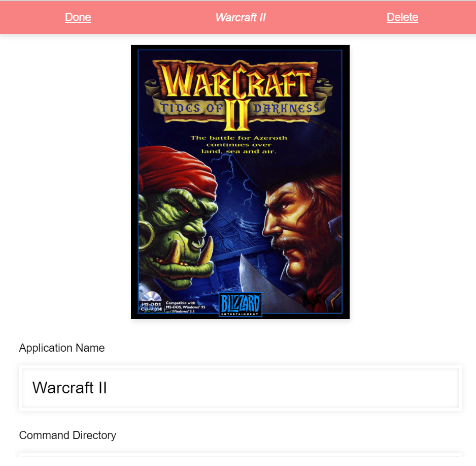

Launcher
--------

#### Quick start

- `git clone git@github.com:JAForbes/launcher.git`
- `cd launcher`
- `npm install`
- `node server`
- open browser to localhost
- Click `Create`
- Give your app a name
- Specify the director
- Specify a command to run to launch the app
- Click `Test Command` to test the command.
- When your happy, click `Done`

#### What?

An experiment writing a desktop app without requiring electron.
It's still easy to use this app architecture with electron, but 
by maintaining client/server separation we encourage performance and we
can also run our app on top of any browser stack.

#### Why?

Electron apps tend to be pretty slow and heavy.
I think Electron should just be a spec proposal for desktop applications in the browser
without mixing the browser and node contexts.  It encourages splitting work across
child processes and we're not locking ourselves into 50mb payloads for 1 - 2mb javascript apps.

#### Contributing

This was only a proof of concept.  It works!  But if you want an actual
frontend for your emulators I suggest checking out retroarch.  If you feel like iterating on
this idea further, then contributions are certainly welcome!